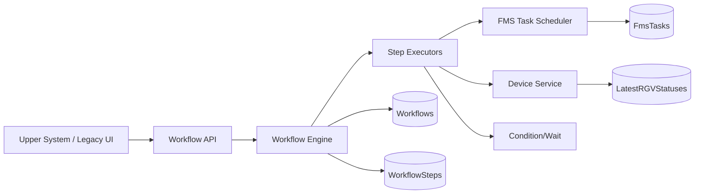
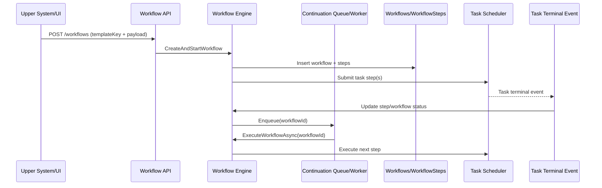

---
# You can also start simply with 'default'
theme: seriph
# random image from a curated Unsplash collection by Anthony
# like them? see https://unsplash.com/collections/94734566/slidev
background: https://cover.sli.dev
# some information about your slides (markdown enabled)
title: FMS Workflow
info: |
  ## FMS Workflow Design Review
# apply unocss classes to the current slide
class: text-center
# https://sli.dev/features/drawing
drawings:
  persist: false
# slide transition: https://sli.dev/guide/animations.html#slide-transitions
transition: slide-left
# enable MDC Syntax: https://sli.dev/features/mdc
mdc: true
author: Jerry Huang
# open graph
# seoMeta:
#  ogImage: https://cover.sli.dev
routerMode: hash
---

# FMS Workflow Design Review

2026-03-11 · Jerry

<!--
The last comment block of each slide will be treated as slide notes. It will be visible and editable in Presenter Mode along with the slide. [Read more in the docs](https://sli.dev/guide/syntax.html#notes)
-->

---

# Agenda

<Toc text-sm minDepth="1" maxDepth="2" />

1. 前期提要：需求與問題整理
2. 設計提案：Workflow Layer
3. Entity / Table Schema
4. 實作規劃、風險與決策點

<!--
You can have `style` tag in markdown to override the style for the current page.
Learn more: https://sli.dev/features/slide-scope-style
-->

<!--
Here is another comment.
-->

---

# 前期提要
### 需求整理

---
transition: slide-up
---

## Nexano Job 層

  

    
    
  

---

## 舊 UI 下發手動流程

  

---

## 換電（典型 Flow）

1. Move to charge/swap station
2. Call station to swap battery
3. Wait station status ready/completed
4. Drive away from station

 

關鍵觀察：這不是單一 task，而是「有順序、有等待、有外部命令」的流程。

---

## 需求來源

| 來源 | 需求描述 | 痛點 |
|---|---|---|
| Nexano（Job 層） | 一次要執行一系列 FMS task | Task 之間缺乏流程語意與控制 |
| 舊 UI | 串接多個 task 的執行需求 | 行為分散在 UI，難以一致治理 |
| 換電功能 | 本質是 flow（移動、呼叫、等待、驅離） | 橫跨設備與條件，Task-only 難處理 |

---

## 現況問題（Task-Only 模型）

1. 目前換電流程是 hard code 邏輯，新增流程常需要重新開發
1. 缺少 workflow-level reservation 時，兩個流程可能搶同一台車，造成交錯與來回執行
1. 無法自然表達跨步驟流程狀態（RUNNING/BLOCKED/FAILED at flow level）
1. Retry/Timeout 只能靠 task 或外部邏輯拼湊，治理成本高
1. 缺少流程級 pause/resume/cancel/retry

---

## 需求收斂

### Functional

- 支援由模板建立可執行流程
- 流程包含多 step，step 可為 Task / Device Command / Wait Condition
- 支援 workflow-level 控制：pause / resume / cancel / retry
- 支援 step-level retry/timeout

### Non-Functional

- 與既有 task scheduler 相容，不重寫核心派工
- 流程狀態可觀測、可查詢
- 可擴展 step 類型，但初期要可控（白名單）

---

# 設計提案
## 在 Task Scheduler 之上增加 Workflow Layer

---

## 提案總覽

- 保留既有 Task Scheduler：負責單一 task 排程與執行
- 新增 Workflow Engine：負責多步驟流程編排
- 使用 Step 作為 building block
- 使用 Executor 執行對應 StepType
- 使用 Built-in Template 鎖定目前允許執行的流程

---

## 架構分層

---

## 核心物件

- `Workflow`
  - 一次流程執行實例（runtime unit）
  - 承載整體狀態、設備綁定、錯誤上下文
- `WorkflowStep`
  - 流程最小執行單位
  - `StepType` 決定交給哪個 Executor
- `Template`
  - 規範可執行流程組合
  - create 時 materialize 成 step snapshot

---

## 為什麼是 Template 白名單

step 理論上可無限組裝，但初期完全開放會導致：

1. 流程組合不可預測，測試面爆炸
2. 設備互斥與安全規則難以保證
3. 上線風險過高

策略：先用 Built-in Template 控制可執行範圍，後續再擴展。

---

## Workflow 狀態模型

| 狀態 | 語意 |
|---|---|
| CREATED / READY | 建立完成，可執行 |
| RUNNING | 正在執行 step |
| TASKS_SUBMITTED | 有 FMS task 在跑 |
| BLOCKED | 等待外部條件/訊號 |
| PAUSED | 人工暫停 |
| FAILED / COMPLETED / CANCELLED | 終態 |

---

## WorkflowStep 狀態模型

| 狀態 | 語意 |
|---|---|
| PENDING | 尚未執行 |
| RUNNING | 執行中 |
| SUCCEEDED | 成功 |
| FAILED / TIMED_OUT | 失敗（可依策略重試） |
| SKIPPED / CANCELLED | 跳過或取消 |

---

## 防止車輛 Ping-Pong 的關鍵設計

1. Workflow 開始執行時先做 workflow-level reservation
2. `Workflows.DeviceId` 記錄流程綁定車輛
3. `LatestRGVStatuses.ReservedJobId = workflowId` 作為設備鎖
4. `ReservedJobIdSnapshot` 確認 workflow 是否仍持有 reservation
5. 流程終態（完成/失敗/取消）才釋放 reservation

---
layout: section
---

# Entity 與 Table Schema
## 以資料模型支撐流程語意

---

  <h3 style="margin: 0 0 8px 0;">Table Overview</h3>
  

---

## `Workflows` Schema

| 欄位 | 說明 |
|---|---|
| `Id` | Workflow runtime id |
| `TemplateKey` | 對應哪個流程模板 |
| `Status` | Workflow 狀態機 |
| `DeviceId` | 綁定設備 id |
| `ReservedJobIdSnapshot` | reservation 持有快照 |
| `SourceId` | 上游來源追蹤 |
| `ErrorCode/ErrorMessage` | 流程錯誤上下文 |

索引：`(Status, CreatedAt)`、`(DeviceId, Status)`

---

## `WorkflowSteps` Schema

| 欄位 | 說明 |
|---|---|
| `WorkflowId + StepNo` | 流程內唯一步驟順序（Unique） |
| `StepType` | FmsTask / DeviceCommand / WaitCondition |
| `Status` | Step 狀態機 |
| `FmsTaskId` | 與底層 task 關聯 |
| `InputPayload` | step input contract（jsonb） |
| `ResultPayload` | step output snapshot（jsonb） |
| `AttemptCount` | retry 次數 |

索引：`(WorkflowId, Status)`

---

## Payload 設計（jsonb）

### `InputPayload`

- 由 template materialization 寫入
- executor 執行時反序列化
- 也用來抽取 retry/timeout policy

### `ResultPayload`

- executor 成功時寫入執行結果快照
- retry 時可重置為 `{}`
- 供查詢與 review 對帳

---

## 與既有表的關聯

1. `FmsTasks.JobId = workflowId.ToString()`
2. `LatestRGVStatuses.ReservedJobId = workflowId`

設計效果：

- 不破壞既有 task scheduler contract
- workflow 層可追蹤 task 終態並做流程續跑
- 沿用既有 reservation 機制，降低改動風險

---

## 範例流程

---
layout: section
---

# 落地規劃
## 實作、風險、Review 決策點

---

## 實作分期提案

1. Schema + Repository
2. Workflow Engine（單 active step + 狀態機）
3. Step Executors（Task / Device / Wait）
4. Template Handlers（白名單）
5. Event-driven continuation + control API

---

## 主要風險與對策

| 風險 | 對策 |
|---|---|
| 跨流程搶車導致 ping-pong | workflow-level reservation + snapshot |
| Payload 無 DB schema | validator + executor contract tests |
| 流程組合爆炸 | template 白名單控管 |
| 狀態轉移複雜 | 明確 state machine + unit/integration tests |

---

## 本次 Design Review 需要確認

1. `Workflows + WorkflowSteps` 作為最小可行 schema
1.  workflow-level reservation 為必要能力（避免 ping-pong）
1. 「Template 白名單」作為第一階段邊界
1. 先實作陣列的 FMS Tasks template，支援 UI 流程與 WCS rgvc 的需求

---

# Q & A
## Discussion / Decision
